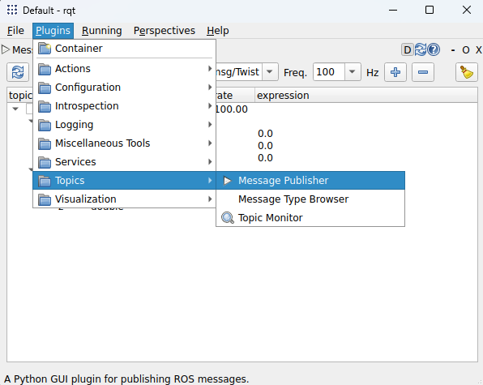
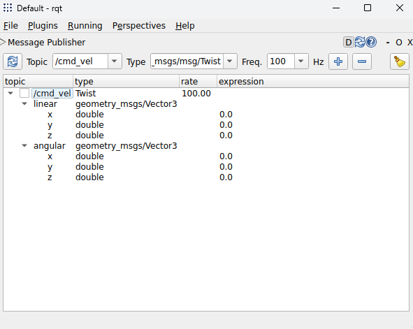

# Kinematic Unicycle Exercise (Python)
In this exercise, we will trying to simulate the Kinematic Model of Unicycle in a ROS2 node. 

## 1) Kinematic Model
The Kinematic Model of Unicycle can be written as:

$$ 
\dot{q}(t) = S(q) \ \nu(t) \rightarrow 
\begin{pmatrix} 
\dot{x} \\
\dot{y} \\
\dot{\theta} \end{pmatrix} = \begin{pmatrix} 
                                \cos(\theta) & 0 \\
                                \sin(\theta) & 0 \\
                                0 & 1 
                            \end{pmatrix}
                                        \begin{pmatrix} 
                                            v \\
                                            \omega
                                        \end{pmatrix}
$$

In order to implement the equation in our node, we have to discretize this differential equation. Using Forward Euler, we can write:
$$\dot{q} \approx \frac{q(k+1) - q(k)}{T_s}$$

where $T_s$ is the sampling period. Finally, we can discretize the Kinematic Model of Unicycle:

$$q(k + 1) = q(k) + T_s \ S(q) \ \nu(k)$$

Expanding the previous equation:

$$\begin{cases}
x_{k+1} = x_k + T_s \ \cos(\theta_k) v_k \\
y_{k+1} = y_k + T_s \ \sin(\theta_k) v_k \\
\theta_{k+1} = \theta_{k} + T_s \ \omega_k
\end{cases}$$

The theoretical part is over, let's start to code.

## 2) Organize the code
The node that we want to write, has as input $\nu = [v \quad \omega]^T$ and output $q = [x \quad y \quad \theta]^T$. We have to choice the ROS msgs for this node. A choice can be:
- Input: [geometry_msgs/Twist](https://docs.ros.org/en/api/geometry_msgs/html/msg/Twist.html)
- Output: [geometry_msgs/Pose2D](https://docs.ros.org/en/api/geometry_msgs/html/msg/Pose2D.html)

The messages definition can be found on the previous links.

## 3) Create Pkg
```bash
cd ~/ros2_ws/src
ros2 pkg create --build-type ament_python --license Apache-2.0 kin_unicycle --dependencies rclpy std_msgs geometry_msgs
```

## 4) Create Simulation Node
```bash
cd kin_unicycle
```
Create the `kinematic_model.py` pasting the following:
```python
# Import ROS Communication Library
import rclpy
from rclpy.node import Node

"""
The Node will publish geometry_msgs/Pose2D (state) and will subscribe to
geometry_msgs/Twist for the velocity command.
"""

# Import Messages
# Pose2D for the State
from geometry_msgs.msg import Pose2D
# Twist for the input
from geometry_msgs.msg import Twist

# import math for model
import numpy as np

## Useful Variables (sorry for the C-style programming)
QUEUE_SIZE = 10             # [-]
SAMPLING_FREQUENCY = 1000   # [Hz]

class Kinematic_Unicycle(Node):

    def __init__(self):
        ## Init Node
        super().__init__('kinematic_unicycle')

        # Publisher and Subscriber
        self.publisher_ = self.create_publisher(Pose2D, '/robot_state', QUEUE_SIZE)
        self.subscriber_ = self.create_subscription(Twist, '/cmd_vel', self.twist_callBack, QUEUE_SIZE)

        # avoid warning
        self.subscriber_

        ## Class Elements for simulation
        # State
        self.x = 0
        self.y = 0
        self.theta = 0

        # Input
        self.v = 0
        self.w = 0

        # Timer
        self.Ts = 1/SAMPLING_FREQUENCY # [s]
        self.timer_ = self.create_timer(self.Ts, self.simulation_loop)

    ### Callbacks ###
    def twist_callBack(self, msg):
        """
        v: x-coordinate of linear part of the msg.
        omega: z-coordinate of angular part of the msg.

        Note: physically the omega is correct, the v is only a magnitude information,
        since the components of the linear velocity are determined by the angle theta.
        """
        # Update control input
        self.v = msg.linear.x
        self.w = msg.angular.z

    def simulation_loop(self):
        """
        In the simulation loop (or main loop), you update
        your variables with the discrete differential equation.
        In the case of unicycle:
        x(k + 1) = x(k) + Ts*cos(theta)*v
        y(k + 1) = y(k) + Ts*sin(theta)*v
        theta(k + 1) = theta(k) + Ts*omega

        We used Forward Euler as discretization method.
        """
        # Update law of the variables
        self.x += self.Ts*np.cos(self.theta)*self.v
        self.y += self.Ts*np.sin(self.theta)*self.v
        self.theta += self.Ts*self.w

        # This avoid theta is out from [-pi, pi] range
        self.theta = self.__wrap2pi(self.theta)

        # Publish the updated state
        self.publish_state()

        """
        Note on the efficiency of this solution:
        The best should update directly the msg type Pose2D and
        avoiding to create and destroy the Pose2D just for publish.
        For huge simulation, this can be critical.
        """
    
    def publish_state(self):
        """
        This is a suboptimal solution to publish the message
        for learning purposes.
        """

        # Create msg object
        msg = Pose2D()

        # Fill
        msg.x = self.x
        msg.y = self.y
        msg.theta = self.theta

        # Publish
        self.publisher_.publish(msg)
    
    @staticmethod
    def __wrap2pi(angle):
        return np.arctan2(np.sin(angle), np.cos(angle))


def main(args=None):
    rclpy.init(args=args)

    kinematic_unicycle = Kinematic_Unicycle()

    rclpy.spin(kinematic_unicycle)

    # Destroy the node explicitly
    # (optional - otherwise it will be done automatically
    # when the garbage collector destroys the node object)
    kinematic_unicycle.destroy_node()
    rclpy.shutdown()


if __name__ == '__main__':
    main()
```

## 5) Add entry points in `setup.py`
```diff
    entry_points={
        'console_scripts': [
+            unicycle = kin_unicycle.kinematic_model:main'
        ],
    },
```
## 6) Build
```bash
colcon build --packages-select kin_unicycle
```

## 7) Run the Simulation Node
```bash
ros2 run kin_unicycle unicycle
```

## 8) Visualization with PlotJuggler
To visualize the state of the simulation, we can use [PlotJuggler](https://plotjuggler.io/).

### 8.1) Install PlotJuggler
```bash
sudo apt install ros-$ROS_DISTRO-plotjuggler-ros
```

### 8.2) Run PlotJuggler
```bash
ros2 run plotjuggler plotjuggler
```

## 9) Publish `Twist` msg by `rqt`
```bash
rqt
```
Navigate in the Topic plugins and press to Topic publisher. You can use easily the GUI to publish the `Twist` msg and command your Kinematic Unicycle.




---

## 10) Extra: IMU Simulator

The goal is to create a node that simulates an Inertial Measurement Unit (IMU) (e.g., [here](https://en.wikipedia.org/wiki/Inertial_measurement_unit)) from the output of the previous kinematic unicycle node.

The IMU sensor provides 9 measurements:

* **Linear Acceleration** ($a_x$, $a_y$, $a_z$), **referred to its local reference frame**;
* **Angular Velocity** ($\omega_x$, $\omega_y$, $\omega_z$);
* **Orientation** usually in Roll-Pitch-Yaw angles or as a quaternion ($q_w$, $q_x$, $q_y$, $q_z$).

These measurements can be computed by numerical differentiation of the state. Furthermore, noise can be added to create a realistic simulation by injecting white noise with standard deviations $\sigma_a$, $\sigma_{\omega}$, and $\sigma_{\theta}$.

### 10.1) Angular Velocity

$$\omega_k \approx \frac{\theta_k - \theta_{k - 1}}{\Delta t} + \mathcal{N}(0, \sigma_{\omega}^{2})$$

### 10.2) Orientation

$$q_k = \text{eul2quat}(0, 0, \theta_k + \mathcal{N}(0, \sigma_{\theta}^{2}))$$

where $\text{eul2quat}$ is the function that converts the Roll-Pitch-Yaw angles to quaternions. For a 2D unicycle, Roll and Pitch are exactly $0$.

### 10.3) Linear Acceleration

This is the hardest to compute since we must differentiate the position twice. First, we find the global linear velocities:

$$v_{x, k} = \frac{x_{k} - x_{k - 1}}{\Delta t}$$

$$v_{y, k} = \frac{y_{k} - y_{k - 1}}{\Delta t}$$

Next, we derive the velocities to find the global accelerations:

$$a_{x, k} = \frac{v_{x, k} - v_{x, k - 1}}{\Delta t}$$

$$a_{y, k} = \frac{v_{y, k} - v_{y, k - 1}}{\Delta t}$$

Interestingly, the previous equation can be expanded, explicating the dependence on $x_{k - 2}$ and $y_{k - 2}$. The variables $a_{x, k}$ and $a_{y, k}$ are currently expressed in the **global reference frame**. An IMU measures acceleration in its own **local reference frame**.

Given the rotation matrix $R$ that transforms from local to global:

$$R = \begin{bmatrix} \cos(\theta_k) & -\sin(\theta_k) \\ 
\sin(\theta_k) & \cos(\theta_k) \end{bmatrix}$$

To report the global acceleration back into the local reference frame and add noise, we multiply by the transpose (or inverse) of the rotation matrix, $R^\top$:

$$a_{\text{IMU}} = R^{\top} \begin{bmatrix} a_{x, k} \\ 
a_{y, k} \end{bmatrix} + \mathcal{N}(0, \sigma^{2}_{a})$$

### 10.4) Implementation

Here is the complete ROS 2 Python node implementing the mathematics above:

```python
# Import ROS Communication Library
import rclpy
from rclpy.node import Node

# Import Messages
from geometry_msgs.msg import Pose2D
from sensor_msgs.msg import Imu

# Import math for calculations and noise generation
import numpy as np

# tf
from tf_transformations import quaternion_from_euler

QUEUE_SIZE = 10
GRAVITY_ACCELERATION = 9.80665 # [m/s^2]

class ImuSimulator(Node):

    def __init__(self):
        super().__init__('imu_simulator')

        # Subscriber and Publisher
        self.subscriber_ = self.create_subscription(
            Pose2D, 
            '/robot_state', 
            self.pose_callback, 
            QUEUE_SIZE
        )
        self.publisher_ = self.create_publisher(Imu, '/imu', QUEUE_SIZE)

        # Avoid unused variable warning
        self.subscriber_

        ## Sensor Noise Parameters (Standard Deviations)
        self.sigma_theta = 0.01  # [rad]
        self.sigma_omega = 0.05  # [rad/s]
        self.sigma_accel = 0.1   # [m/s^2]

        ## Class Elements for numerical differentiation
        self.prev_time = None
        
        # Previous Pose
        self.prev_x = 0.0
        self.prev_y = 0.0
        self.prev_theta = 0.0
        
        # Previous Global Velocities
        self.prev_vx = 0.0
        self.prev_vy = 0.0

    def pose_callback(self, msg):
        """
        Callback triggered every time a new Pose2D is published.
        Computes the first and second derivatives to estimate IMU data.
        """
        current_time = self.get_clock().now()

        # Initialize previous state on the very first callback
        if self.prev_time is None:
            self.prev_time = current_time
            self.prev_x = msg.x
            self.prev_y = msg.y
            self.prev_theta = msg.theta
            return

        # Calculate delta time (dt) in seconds
        dt = (current_time - self.prev_time).nanoseconds / 1e9

        # Prevent division by zero if messages arrive instantly
        if dt <= 0.0:
            return

        ### 1. Compute Ideal Global Velocities (First Derivative)
        vx = (msg.x - self.prev_x) / dt
        vy = (msg.y - self.prev_y) / dt

        # Compute angular velocity (wrap the angle difference to avoid jumps at pi/-pi)
        d_theta = msg.theta - self.prev_theta
        d_theta = np.arctan2(np.sin(d_theta), np.cos(d_theta))
        omega_ideal = d_theta / dt

        ### 2. Compute Ideal Global Accelerations (Second Derivative)
        ax = (vx - self.prev_vx) / dt
        ay = (vy - self.prev_vy) / dt

        ### 3. Transform Accelerations to the Body Frame
        accel_body_x_ideal = ax * np.cos(msg.theta) + ay * np.sin(msg.theta)
        accel_body_y_ideal = -ax * np.sin(msg.theta) + ay * np.cos(msg.theta)

        ### 4. Inject Gaussian Noise
        # N(mean=ideal_value, std_dev=sigma)
        theta_noisy = msg.theta + np.random.normal(0.0, self.sigma_theta)
        omega_noisy = omega_ideal + np.random.normal(0.0, self.sigma_omega)
        accel_x_noisy = accel_body_x_ideal + np.random.normal(0.0, self.sigma_accel)
        accel_y_noisy = accel_body_y_ideal + np.random.normal(0.0, self.sigma_accel)

        ### 5. Build and Publish the IMU Message
        self.publish_imu(theta_noisy, omega_noisy, accel_x_noisy, accel_y_noisy, current_time)

        ### 6. Update state variables for the next iteration 
        self.prev_time = current_time
        self.prev_x = msg.x
        self.prev_y = msg.y
        self.prev_theta = msg.theta
        self.prev_vx = vx
        self.prev_vy = vy

    def publish_imu(self, theta, omega, accel_x, accel_y, current_time):
        
        imu_msg = Imu()
        
        # Header setup
        imu_msg.header.stamp = current_time.to_msg()
        imu_msg.header.frame_id = 'base_link'

        ### ORIENTATION
        # Convert Roll (0), Pitch (0), and Yaw (theta) to a Quaternion
        q = quaternion_from_euler(0.0, 0.0, theta)
        
        imu_msg.orientation.x = q[0]
        imu_msg.orientation.y = q[1]
        imu_msg.orientation.z = q[2]
        imu_msg.orientation.w = q[3]

        # Populate Orientation Covariance matrix (diagonal only)
        imu_msg.orientation_covariance[8] = self.sigma_theta ** 2

        ### ANGULAR VELOCITY
        imu_msg.angular_velocity.x = 0.0
        imu_msg.angular_velocity.y = 0.0
        imu_msg.angular_velocity.z = float(omega)

        # Populate Angular Velocity Covariance matrix
        imu_msg.angular_velocity_covariance[8] = self.sigma_omega ** 2

        ### LINEAR ACCELERATION
        imu_msg.linear_acceleration.x = float(accel_x)
        imu_msg.linear_acceleration.y = float(accel_y)
        # Add gravity to the Z axis, plus the sensor noise
        imu_msg.linear_acceleration.z = GRAVITY_ACCELERATION + np.random.normal(0.0, self.sigma_accel) 

        # Populate Linear Acceleration Covariance matrix
        imu_msg.linear_acceleration_covariance[0] = self.sigma_accel ** 2  # x-axis
        imu_msg.linear_acceleration_covariance[4] = self.sigma_accel ** 2  # y-axis
        imu_msg.linear_acceleration_covariance[8] = self.sigma_accel ** 2  # z-axis

        self.publisher_.publish(imu_msg)


def main(args=None):
    rclpy.init(args=args)
    imu_simulator = ImuSimulator()
    
    try:
        rclpy.spin(imu_simulator)
    except KeyboardInterrupt:
        pass
    finally:
        imu_simulator.destroy_node()
        # Only shutdown if context is still valid
        if rclpy.ok():
            rclpy.shutdown()

if __name__ == '__main__':
    main()

```

### 10.5) Building and Running

To successfully compile and execute this node within your workspace, ensure your package configuration files are updated.

**1. Update `package.xml`**
Add the required dependencies:

```diff
<exec_depend>rclpy</exec_depend>
<exec_depend>geometry_msgs</exec_depend>
+<exec_depend>sensor_msgs</exec_depend>
+<exec_depend>tf_transformations</exec_depend>
```

**2. Update `setup.py`**
Register the executable in the `entry_points` block:

```diff
entry_points={
    'console_scripts': [
        'kinematic_unicycle = your_package_name.kinematic_unicycle:main', 
+        'imu_simulator = your_package_name.imu_simulator:main',
    ],
},

```
